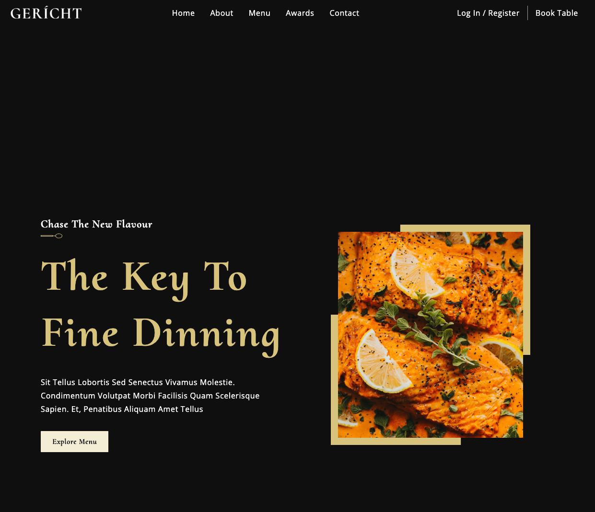

# Example Restaurant Website in React



## Clone

```shell
git clone https://github.com/samiralibabic/gericht.git
```

## Install dependencies

```shell
npm install
```

## Run

```shell
npm run start
```

Open `http://localhost:3000` to preview the project.
